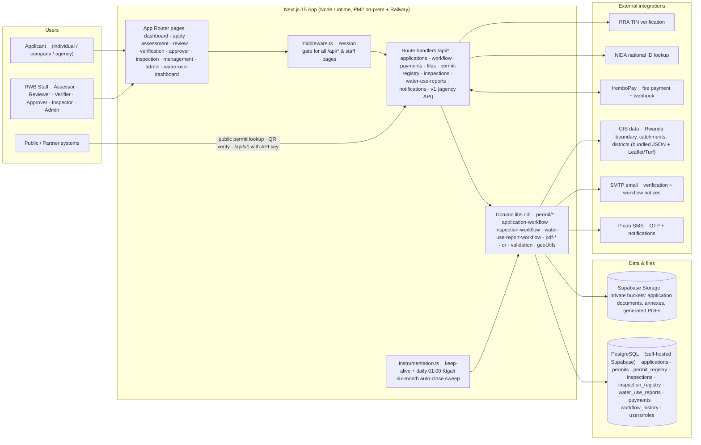
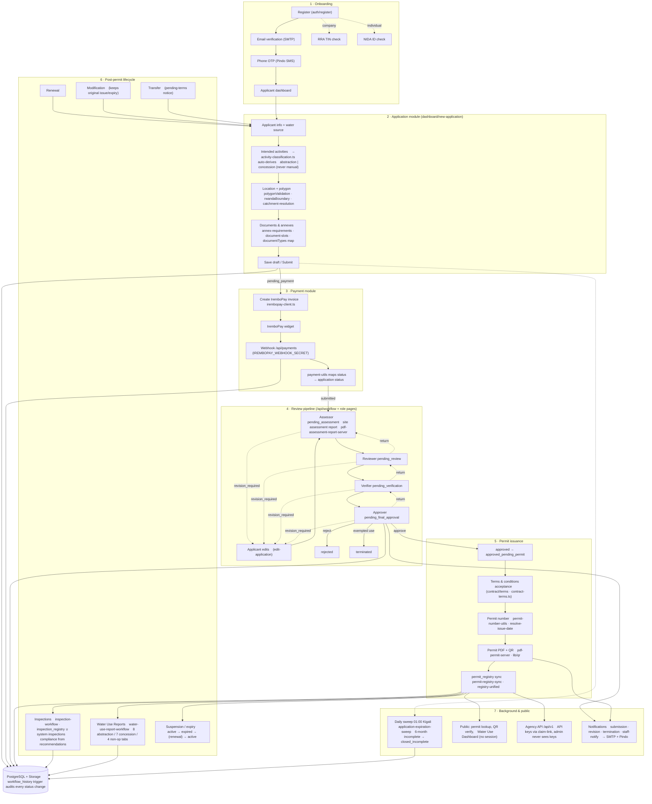

# Rwanda Water Permit System — Architecture Diagrams

## 1. High-level architecture

```mermaid
flowchart LR
    subgraph Users["Users"]
        APP["Applicant    (individual / company / agency)"]
        STAFF["RWB Staff    Assessor · Reviewer · Verifier · Approver · Inspector · Admin"]
        PUB["Public / Partner systems"]
    end

    subgraph NEXT["Next.js 15 App (Node runtime, PM2 on-prem + Railway)"]
        MW["middleware.ts    session gate for all /api/* & staff pages"]
        UI["App Router pages    dashboard · apply · assessment · review · verification · approver · inspection · management · admin · water-use-dashboard"]
        API["Route handlers /api/*    applications · workflow · payments · files · permit-registry · inspections · water-use-reports · notifications · v1 (agency API)"]
        LIB["Domain libs /lib    permit/* · application-workflow · inspection-workflow · water-use-report-workflow · pdf-* · qr · validation · geoUtils"]
        SCHED["instrumentation.ts    keep-alive + daily 01:00 Kigali six-month auto-close sweep"]
    end

    subgraph DATA["Data & files"]
        PG[("PostgreSQL    (self-hosted Supabase)    applications · permits · permit_registry · inspections · inspection_registry · water_use_reports · payments · workflow_history · users/roles")]
        STORE[("Supabase Storage    private buckets: application documents, annexes, generated PDFs")]
    end

    subgraph EXT["External integrations"]
        IREMBO["IremboPay    fee payment + webhook"]
        PINDO["Pindo SMS    OTP + notifications"]
        SMTP["SMTP email    verification + workflow notices"]
        NIDA["NIDA    national ID lookup"]
        RRA["RRA    TIN verification"]
        GIS["GIS data    Rwanda boundary, catchments, districts (bundled JSON + Leaflet/Turf)"]
    end

    APP --> UI
    STAFF --> UI
    PUB -->|"public permit lookup · QR verify · /api/v1 with API key"| API
    UI --> MW --> API --> LIB
    LIB --> PG
    LIB --> STORE
    SCHED --> LIB
    API <--> IREMBO
    LIB --> PINDO
    LIB --> SMTP
    API --> NIDA
    API --> RRA
    LIB --> GIS
```

## 2. Detailed module and flow diagram

```mermaid
flowchart TB
    subgraph A["1 · Onboarding"]
        A1["Register    (auth/register)"] --> A2["Email verification    (SMTP)"] --> A3["Phone OTP    (Pindo SMS)"]
        A1 -.->|company| A4["RRA TIN check"]
        A1 -.->|individual| A5["NIDA ID check"]
        A3 --> A6["Applicant dashboard"]
    end

    subgraph B["2 · Application module (dashboard/new-application)"]
        B1["Applicant info + water source"] --> B2["Intended activities    → activity-classification.ts auto-derives    abstraction | concession (never manual)"]
        B2 --> B3["Location + polygon    polygonValidation · rwandaBoundary · catchment-resolution"]
        B3 --> B4["Documents & annexes    annex-requirements · document-slots · documentTypes map"]
        B4 --> B5["Save draft / Submit"]
    end

    subgraph C["3 · Payment module"]
        C1["Create IremboPay invoice    irembopay-client.ts"] --> C2["IremboPay widget"]
        C2 --> C3["Webhook /api/payments    (IREMBOPAY_WEBHOOK_SECRET)"]
        C3 --> C4["payment-utils maps status    → application status"]
    end

    subgraph D["4 · Review pipeline (/api/workflow + role pages)"]
        direction LR
        D1["Assessor    pending_assessment    site assessment report    pdf-assessment-report-server"] --> D2["Reviewer    pending_review"] --> D3["Verifier    pending_verification"] --> D4["Approver    pending_final_approval"]
        D2 -.->|return| D1
        D3 -.->|return| D2
        D4 -.->|return| D3
        RV["Applicant edits    (edit-application)"]
        D1 -.->|revision_required| RV
        D2 -.->|revision_required| RV
        D3 -.->|revision_required| RV
        D4 -.->|revision_required| RV
        RV --> D1
        D4 -->|reject| RJ["rejected"]
        D4 -->|exempted use| TM["terminated"]
    end

    subgraph E["5 · Permit issuance"]
        E1["approved → approved_pending_permit"] --> E2["Terms & conditions acceptance    (contract/terms · contract-terms.ts)"]
        E2 --> E3["Permit number    permit-number-utils · resolve-issue-date"]
        E3 --> E4["Permit PDF + QR    pdf-permit-server · lib/qr"]
        E4 --> E5["permit_registry sync    permit-registry-sync · registry-unified"]
    end

    subgraph F["6 · Post-permit lifecycle"]
        F1["Renewal"]
        F2["Modification    (keeps original issue/expiry)"]
        F3["Transfer    (pending-terms notice)"]
        F4["Inspections    inspection-workflow · inspection_registry ∪ system inspections    compliance from recommendations"]
        F5["Water Use Reports    water-use-report-workflow    8 abstraction / 7 concession / 4 non-op tabs"]
        F6["Suspension / expiry    active → expired → (renewal) → active"]
    end

    subgraph G["7 · Background & public"]
        G1["Daily sweep 01:00 Kigali    application-expiration-sweep    6-month incomplete → closed_incomplete"]
        G2["Public: permit lookup, QR verify,    Water Use Dashboard (no session)"]
        G3["Agency API /api/v1    API keys via claim-link, admin never sees keys"]
        G4["Notifications    submission · revision · termination · staff-notify    → SMTP + Pindo"]
    end

    A6 --> B1
    B5 -->|pending_payment| C1
    C4 -->|submitted| D1
    D4 -->|approve| E1
    F1 --> B1
    F2 --> B1
    F3 --> B1
    E5 --> F4
    E5 --> F5
    E5 --> F6
    E5 --> G2
    E5 --> G3
    D4 --> G4
    E4 --> G4
    B5 -.-> G1

    DB[("PostgreSQL + Storage    workflow_history trigger audits every status change")]
    B5 --> DB
    C3 --> DB
    D4 --> DB
    E5 --> DB
    F4 --> DB
    F5 --> DB
    G1 --> DB
```
